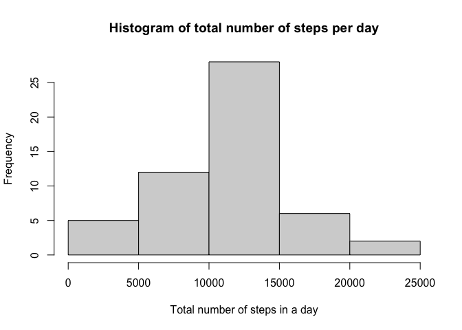
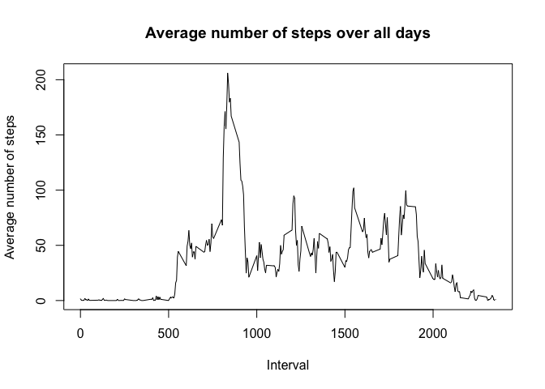
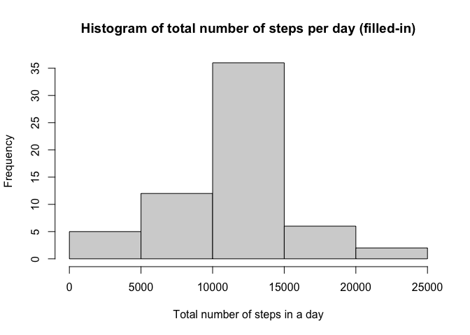
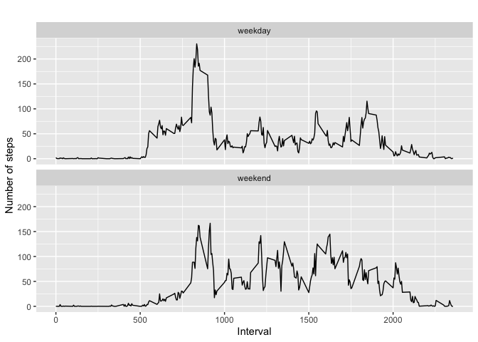

### Loading and preprocessing the data


```r
mydf<-read.csv("activity.csv", stringsAsFactors = FALSE)
```
Exploring the data

```r
dim(mydf)	
```

```
## [1] 17568     3
```

```r
head(mydf)
```

```
##   steps       date interval
## 1    NA 2012-10-01        0
## 2    NA 2012-10-01        5
## 3    NA 2012-10-01       10
## 4    NA 2012-10-01       15
## 5    NA 2012-10-01       20
## 6    NA 2012-10-01       25
```


### What is mean total number of steps taken per day?
1.Removing the missing values:

```r
mydfc <-filter(mydf, !is.na(steps))
```
2.Calculate the total number of steps taken per day

```r
by_day <- group_by(mydfc, date)
steps_by_day <- summarise(by_day, total = sum(steps))
```

```
## `summarise()` ungrouping output (override with `.groups` argument)
```

3.Histogram of the total number of steps taken each day


```r
hist(steps_by_day$total, main="Histogram of total number of steps per day", xlab="Total number of steps in a day")
```

<!-- -->

4.Calculate and report the mean and median total number of steps taken per day


```r
mean_day <- mean(steps_by_day$total)
```
The mean per day is 10766.1886792.


```r
median_day <- median(steps_by_day$total)
```
The median per day is 10765.

Summary of the steps per day table:


### What is the average daily activity pattern?


```r
steps_by_interval <- aggregate(steps ~ interval, mydfc, mean)
```
1.Make a time series plot (i.e. type = "l") of the 5-minute interval (x-axis) and the average number of steps taken, averaged across all days (y-axis)

```r
plot(steps_by_interval$interval, steps_by_interval$steps, type='l', 
     main="Average number of steps over all days", xlab="Interval", 
     ylab="Average number of steps")
```

<!-- -->
2.Which 5-minute interval, on average across all the days in the dataset, contains the maximum number of steps?

```r
max_steps_row <- which.max(steps_by_interval$steps)
steps_by_interval[max_steps_row, ]
```

```
##     interval    steps
## 104      835 206.1698
```


### Imputing missing values
1.Calculate and report the total number of missing values in the dataset (i.e. the total number of rows with NAs)


```r
missing <-sum(is.na(mydf))
```
The total number of missing values is 2304.

2.Strategy for filling in all of the missing values in the dataset: filling up mean value for the 5 min interval when NA.

3.The new dataset that is equal to the original dataset but with the missing data filled in is "data".


```r
data <- mydf
for (i in 1:nrow(data)) {
  if (is.na(data$steps[i])) {
    interval_value <- data$interval[i]
    steps_value <- steps_by_interval[
      steps_by_interval$interval == interval_value,]
    data$steps[i] <- steps_value$steps
  }
}
```
4.Make a histogram of the total number of steps taken each day and Calculate and report the mean and median total number of steps taken per day. Do these values differ from the estimates from the first part of the assignment? What is the impact of imputing missing data on the estimates of the total daily number of steps?


```r
data_by_day <- group_by(data, date)
data_steps_by_day <- summarise(data_by_day, total = sum(steps))
```

```
## `summarise()` ungrouping output (override with `.groups` argument)
```

3.Histogram of the total number of steps taken each day


```r
hist(data_steps_by_day$total, main="Histogram of total number of steps per day (filled-in)", xlab="Total number of steps in a day")
```

<!-- -->


```r
mean2_day <- mean(data_steps_by_day$total)
```
The mean per day is 10766.1886792.


```r
median2_day <- median(data_steps_by_day$total)
```
The median per day is 10766.1886792.

The mean values are the same for both tables (without NA and filled-in) but the median of the filled-in table is now slighly different.

### Are there differences in activity patterns between weekdays and weekends?


```r
data['type_of_day'] <- weekdays(as.Date(data$date))
data$type_of_day[data$type_of_day  %in% c('Saturday','Sunday') ] <- "weekend"
data$type_of_day[data$type_of_day != "weekend"] <- "weekday"
```


```r
data$type_of_day <- as.factor(data$type_of_day)
```
Calculate average steps by interval across all days

```r
df_steps_by_interval <- aggregate(steps ~ interval + type_of_day, data, mean)
```

### Plot

```r
qplot(interval, 
      steps, data = df_steps_by_interval, geom=c("line"),xlab = "Interval", 
      ylab = "Number of steps", main = "") + facet_wrap(~ type_of_day, ncol = 1)
```

<!-- -->

